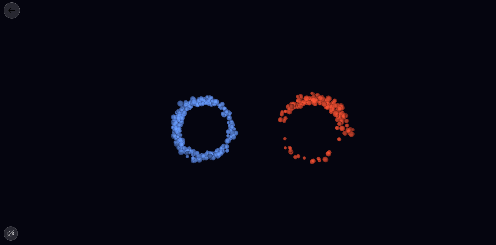

# DUALISMO

Il progetto Dualismo trasforma un conflitto psicologico in un'esperienza che si può vedere e ascoltare, simulando la dinamica di un litigio umano attraverso luci e suoni. L'opera mette in scena uno scontro basato sulla dialettica degli opposti, dove il linguaggio è fatto di frequenze sonore e forme geometriche che si modificano.

Da un lato  c'è la Personalità Blu, che rappresenta la ragione e usa frequenze costanti e regolari, simbolo di controllo e logica.


 Dall'altro troviamo la Personalità Rossa, che rappresenta l'istinto e si esprime con suoni acuti e pungenti per comunicare un'emozione immediata.




---


## L'interazione

Il controllo avviene tramite il movimento delle mani, tracciato da appositi sensori. Allontanando il pollice dall'indice si mima il gesto di aprire la bocca: più le dita si distanziano, più il suono diventa forte e la forma visiva sullo schermo si ingrandisce. Questa interazione si può vivere in due modi, ovvero da soli, controllando l'istinto con una mano e la ragione con l'altra per mettere in scena una lotta interiore, oppure in due giocatori, dando vita a una vera e propria discussione tra due persone.

Il cuore del litigio si esprime attraverso il modo in cui i due elementi invadono lo spazio dell'altro. Il cerchio visivo, perde la sua forma regolare e mostra bordi frastagliati che descrivono graficamente l'alzarsi dei toni. Chi invade il territorio dell'avversario diventa più aggressivo, ma nel momento in cui le mani dei partecipanti si allontanano, la tensione svanisce e le forme tornano geometricamente calme, simulando la pace dopo un litigio.

---


## INTEGRAZIONE CON ARDUINO (opzionale)

Infine, è opzionale l'uso di Arduino e i led, che portano l'esperienza fuori dallo schermo e dentro la stanza. L'ambiente viene diviso a metà dalle luci rosse e blu, che si fanno più intense e si spostano verso il centro man mano che i partecipanti "parlano" aprendo le dita. Quando le due personalità si scontrano e si sovrappongono, il sistema genera un flash luminoso, segnando il culmine dello scontro.

Dualismo esplora il fragile legame tra logica ed emozione, usando un'estetica semplice per far riflettere su come il confronto non debba portare alla distruzione dell'altro, ma alla comprensione della tensione che nasce da ogni incontro.


## CODICE ARDUINO

```
#include 

#define PIN        6
#define NUMPIXELS 200 

Adafruit_NeoPixel strip(NUMPIXELS, PIN, NEO_GRB + NEO_KHZ800);

void setup() {
  Serial.begin(9600);
  strip.begin();
  strip.setBrightness(150);
  strip.show();
}

void loop() {
  if (Serial.available() >= 3) {
    int valSX = Serial.read(); 
    int valDX = Serial.read(); 
    int ins = Serial.read();

    strip.clear();

    //MANO SINISTRA
    int qSX = (valSX > 100) ? valSX - 101 : valSX;
    uint32_t colSX = (valSX > 100) ? strip.Color(150, 0, 255) : strip.Color(255, 0, 0);

    //MANO DESTRA 
    int qDX = (valDX > 100) ? valDX - 101 : valDX;
    uint32_t colDX = (valDX > 100) ? strip.Color(0, 255, 0) : strip.Color(0, 0, 255);

    //DISEGNO SINISTRA (0 -> 100) ---
    if (qSX > 0) {
      for (int i = 0; i  0) ? random(150, 255) : 255;
          strip.setPixelColor(i, applyBrightness(colSX, br));
        }
      }
    }

    //DISEGNO DESTRA (199 -> 100) 
    if (qDX > 0) {
      for (int i = 0; i  0) ? random(150, 255) : 255;
          strip.setPixelColor(currentLed, applyBrightness(colDX, br));
        }
      }
    }

    // CENTRALE 
    if (qSX >= 98 && qDX >= 98) {
       strip.setPixelColor(99, colSX);
       strip.setPixelColor(100, colDX);
    }

    strip.show();
  }
}

uint32_t applyBrightness(uint32_t c, int b) {
  uint8_t r = (uint8_t)(c >> 16), g = (uint8_t)(c >> 8), bl = (uint8_t)c;
  return strip.Color((r * b) / 255, (g * b) / 255, (bl * b) / 255);
}
```
---

Creato da: Manuela Traccitto
ABAFR Media Art
2026/2027